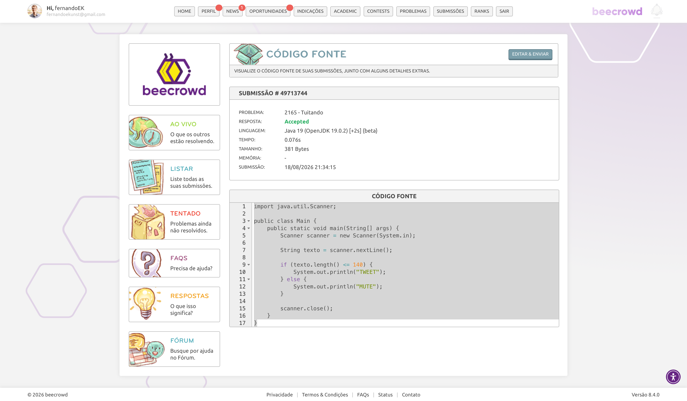

# Exercício E1 - JUnit

Exercício da disciplina de Verificação e Validação de Software utilizando Java, Maven e JUnit 6.

## Problema escolhido

**BeeCrowd 2165 - Twitting**

O programa recebe uma mensagem e verifica se ela possui até 140 caracteres.

- Até 140 caracteres: `TWEET`

- Mais de 140 caracteres: `MUTE`

## Estrutura

O projeto possui:

- `Main.java` - classe principal do programa;

- `Ttwitting.java` - classe auxiliar com a lógica do exercício;

- `TtwittingTest.java` - testes unitários da classe auxiliar;

- `pom.xml` - configuração do Maven e JUnit 6.

## Testes

Foram criados testes para diferentes tamanhos de mensagem, incluindo os casos de fronteira de 140 e 141 caracteres.

Os testes podem ser executados pelo Maven com:

```bash
mvn test
```

## Confirmação do BeeCrowd

A solução foi submetida ao BeeCrowd e obteve resultado **Accepted**.

### Evidência da submissão



